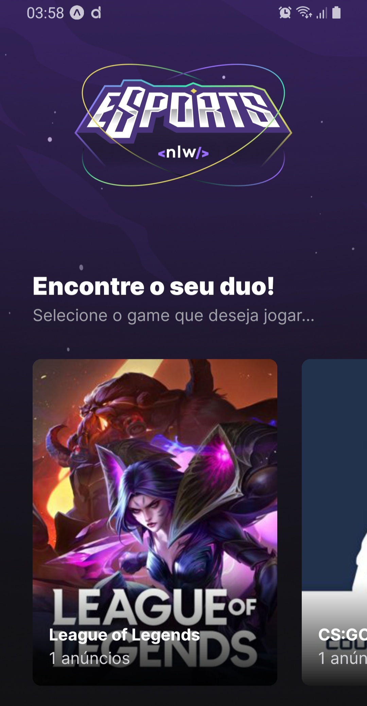
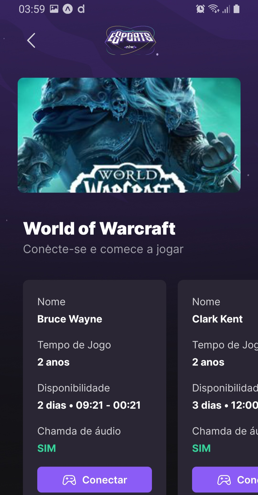
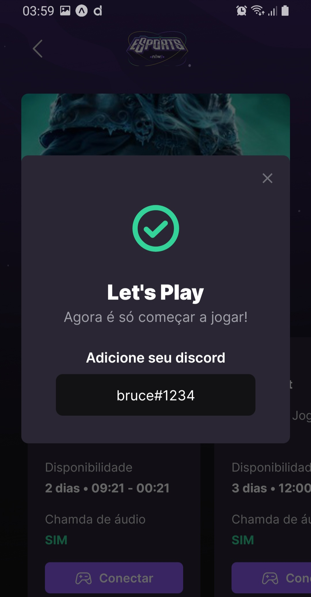

<h1 align="center">eSports</h1>

  
  
  

## Tecnologias

Esse projeto foi desenvolvido com as seguintes tecnologias:

- [React](https://reactjs.org)
- [React Native](https://reactnative.dev)
- [Expo](https://expo.io)
- [TypeScript](https://www.typescriptlang.org)

## Projeto

ESports é um App para você convidar um amigo para aquela jogatina,
é só conectar no app e convidar o amigo(a)

## Para rodar o projeto:

- Instale os módulos: `npm install` ou `yarn`
- No frontend:
  - Rode: `expo start`
